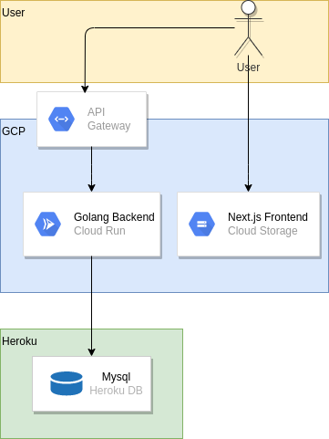

# go-next-portfolio

[ポートフォリオサイト](https://storage.googleapis.com/aono-portfolio-frontend/index.html)

## Golang + Next.jsによるポートフォリオサイト

DBはmysqlでHerokuを使用しています。

Golangはクリーンアーキテクチャを採用しています。
デプロイ先はGCPのCloud Runでサーバレスで運用しています。
また、CRUDの内CUDに関してはAPI GatewayでGoogle IDによるOAuth認証をかけています。

TypescriptはNext.jsを使用しています。
SSGで生成し、GCSに配置しています。
CRUDの内CUDを操作出来るAdminページはGCS側で認証をかけています。

## ディレクトリ構成

```bash
.
├── docs       # ドキュメント
├── infra      # インフラ
├── script     # スクリプト
├── go         # バックエンド
└── typescript # フロントエンド
```

## アーキテクチャ図



## 詳細

[golangの詳細](https://github.com/Jyury11/go-next-portfolio/tree/main/go)
[next.jsの詳細](https://github.com/Jyury11/go-next-portfolio/tree/main/typescript)
