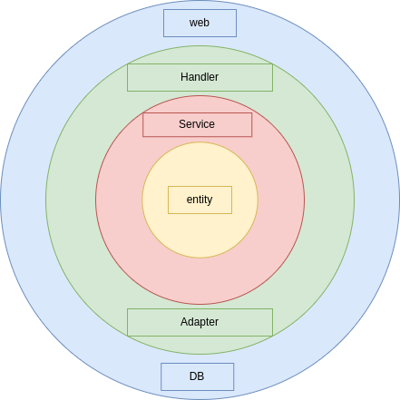
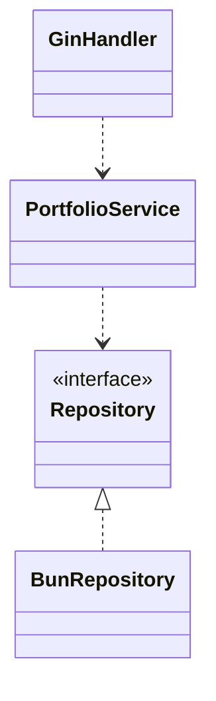

# portfolio golang

## ディレクトリ構成

```bash
.
├── build       #ローカル環境構築ファイル
│   └── db
│   └── api
├── cmd         #アプリケーション エンドポイント
│   └── api          #APIエンドポイント
│       └── main.go
│       └── di       # DIコンテナ
├── internal    # APIサーバー実装
│   └── adapters      # Repository実装
│   └── entity        # Domain・Repository定義
│   └── handler       # Handler (クリーンアーキテクチャのController)
│   └── service       # Use Case
└── pkg         # 共通ライブラリ
    └── db
    └── http
```

## アーキテクチャ図



## クラス図


